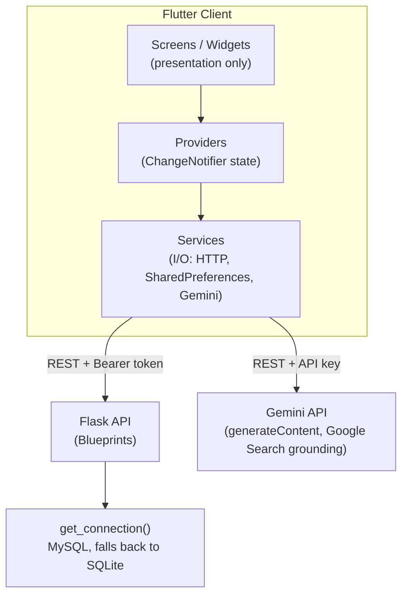
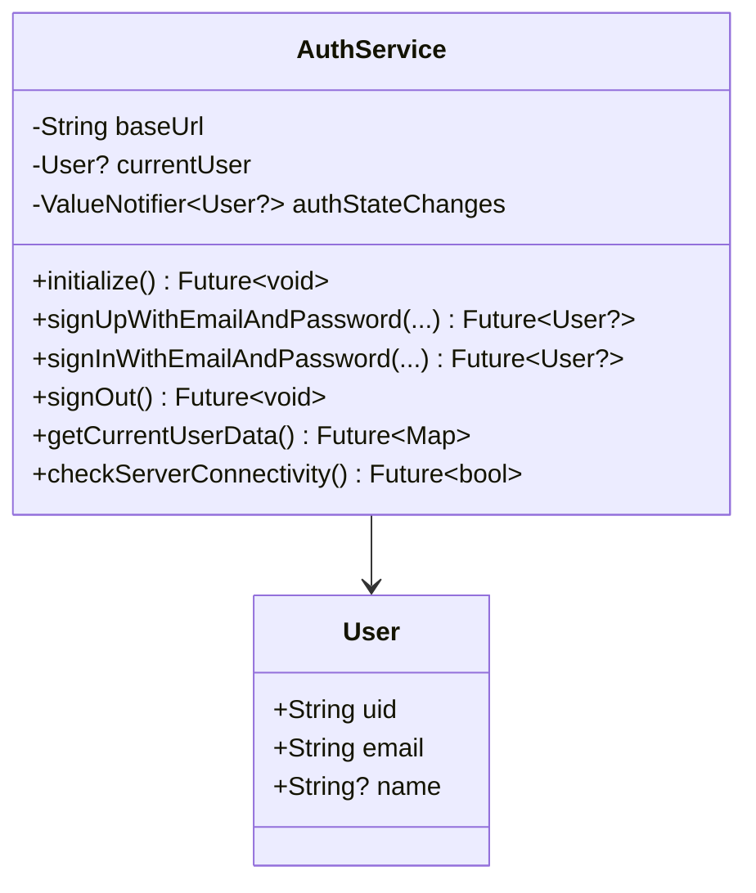
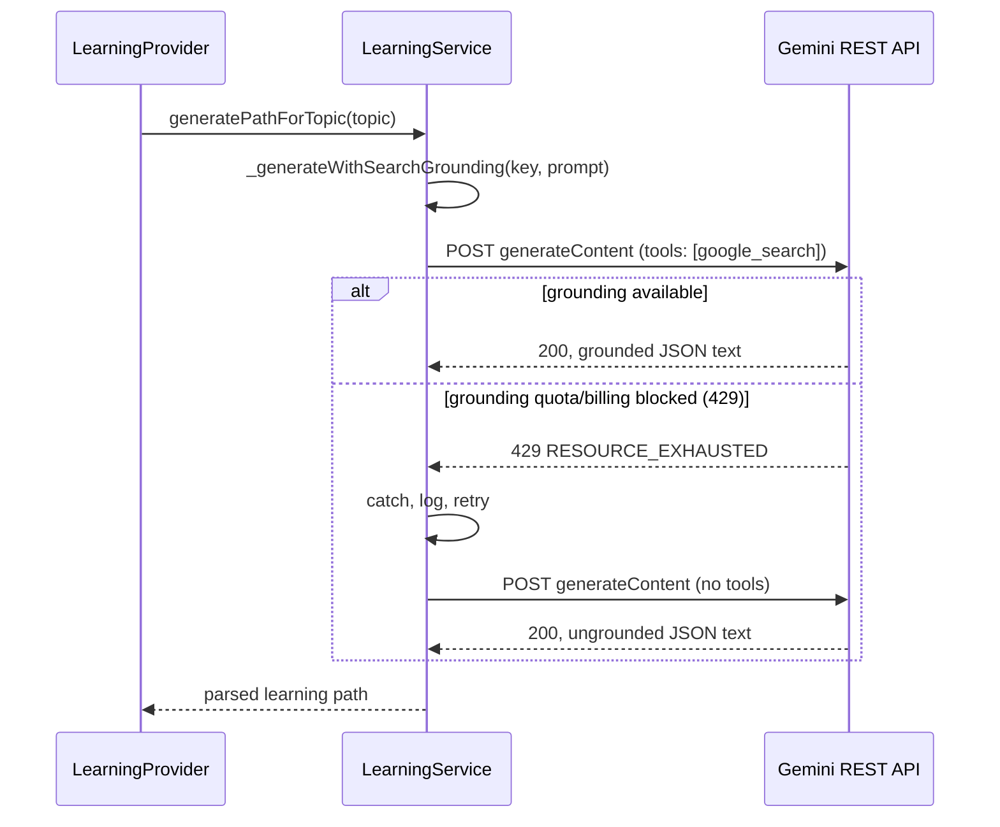
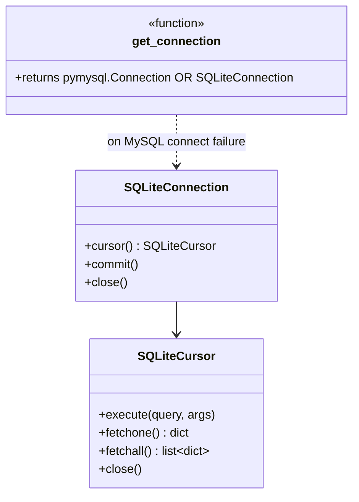
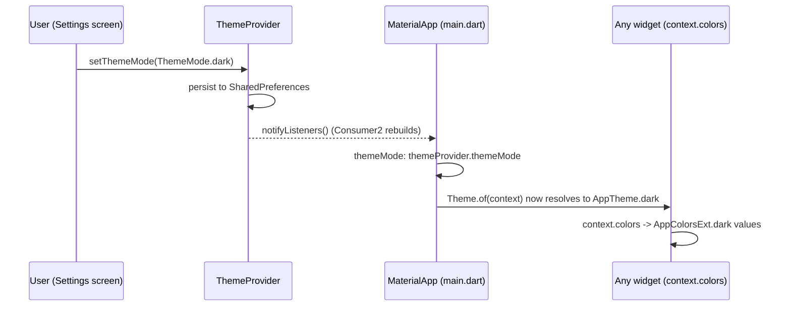

# LearnTrack — Design & Class Design Document

This document is the technical companion to `PROJECT_OVERVIEW.md` (which is
written for a non-technical walkthrough). This one is for engineers: why the
code is organized the way it is, what each class is responsible for, what
design patterns are in play, and what the alternatives were.

---

## 1. Architectural style

LearnTrack is a **layered client-server app**: a Flutter client, a Flask
REST API, and a third-party AI service (Gemini) called directly from the
client. There is no single "God object" — state, I/O, and presentation are
each owned by a different layer, and each layer only talks to the layer
directly below it.



The rule that keeps this from decaying: **widgets never call services
directly, and services never touch `BuildContext` or Flutter widgets.**
A screen can be swapped without touching a provider; a provider can be
swapped without touching a service; the backend's storage engine can change
(MySQL ↔ SQLite) without a single blueprint route noticing.

---

## 2. Frontend class design

### 2.1 Why three layers (Screens → Providers → Services), not two

A common shortcut is to let widgets call HTTP/storage code directly. That
was avoided here specifically because:

- **Testability** — a provider's logic (e.g. "sequential lesson gating" in
  `completeLesson`) can be reasoned about and tested without a widget tree.
- **Reuse** — `LearningService.getCurrentCourses()` is used by
  `LearningProvider` regardless of which of the 7 screens is currently
  visible; the fetch-then-cache-fallback logic lives in exactly one place.
- **The Observer pattern needs an owner** — Flutter's `Consumer`/`Provider`
  widgets rebuild in response to `notifyListeners()`. Something has to be
  the `ChangeNotifier`; that's the provider's whole reason to exist.

### 2.2 Providers — state + change notification

All three providers extend `ChangeNotifier`, Flutter's built-in
implementation of the **Observer pattern**: widgets subscribe (via
`Consumer`/`Provider.of`), the provider calls `notifyListeners()` after any
state mutation, and Flutter re-runs only the subscribed widgets' `build()`.

#### `AuthProvider` (`lib/providers/auth_provider.dart`)

Owns the current session. Wraps `AuthService` and exposes it as reactive
state (`user`, `isAuthenticated`, `userData`, `isLoading`, `error`).

| Responsibility | Method(s) |
|---|---|
| Bootstrap session from stored token | `_initialize()` (constructor-called) |
| Sign up / sign in / sign out | `signUp`, `signIn`, `signOut` |
| React to the service's internal auth-state stream | `_onAuthStateChanged()` |
| Expose derived, UI-friendly fields | `fullName`, `age`, `email` getters over the raw `userData` map |

Design choice: `AuthService` has its own `ValueNotifier<User?>
authStateChanges` internally (see 2.3), and `AuthProvider` subscribes to
*that* rather than polling. This means any code path in `AuthService` that
changes the user (token expiring, `initialize()` restoring a session) is
automatically reflected in the provider without `AuthService` needing to
know Flutter's `ChangeNotifier` exists at all. `AuthService` stays a plain
Dart class with zero Flutter framework dependency — this is intentional,
so it could be unit-tested or reused (e.g. in a CLI tool) without dragging
in `package:flutter`.

#### `LearningProvider` (`lib/providers/learning_provider.dart`)

Owns courses, generated learning paths, and streak data — and is the only
place that *mutates* them (`completeModule`, `completeLesson`,
`generateLearningPath`, `deletePath`, `updateStreak`).

The interesting design decision here is **how it learns about login/logout**
without every screen having to wire that up:

```dart
void setAuthProvider(AuthProvider authProvider) {
  _authProvider = authProvider;
  _authProvider!.addListener(_onAuthStateChanged);
}
```

`LearningProvider` listens to `AuthProvider` directly — this is the
**Proxy pattern**, and `main.dart` wires it via `ChangeNotifierProxyProvider`
rather than a plain `ChangeNotifierProvider`:

```dart
ChangeNotifierProxyProvider<AuthProvider, LearningProvider>(
  create: (_) => LearningProvider(),
  update: (_, authProvider, learningProvider) {
    learningProvider!.setAuthProvider(authProvider);
    return learningProvider;
  },
),
```

Alternative considered: have every screen call
`context.read<AuthProvider>()` and manually trigger
`context.read<LearningProvider>().refresh()` on login/logout. Rejected
because it means every new screen that can trigger a login/logout has to
remember to do this — a single missed call site silently leaves stale data
on screen. Wiring it once at the provider level makes it structurally
impossible to forget.

Every mutation in this class follows one repeated shape (worth naming
because it's the actual "class design" here, not just a list of methods):

```
1. Update in-memory state
2. notifyListeners()      -> UI updates instantly, optimistically
3. Persist via LearningService (local storage first, then best-effort server sync)
```

`deletePath(int pathIndex)` is a good example of why step 3 has to be
unconditional even when the result is "empty":

```dart
Future<void> deletePath(int pathIndex) async {
  final removed = _learningPaths.removeAt(pathIndex);
  _currentCourses.removeWhere((c) => c['title'] == removed['title']);
  await _saveLearningPaths();   // must run even if _learningPaths is now []
  await _saveCourses();
  notifyListeners();
}
```

An earlier version of `_saveCourses`/`_saveLearningPaths` skipped the save
whenever the list was empty (`if (uid != null && list.isNotEmpty)`) — which
meant deleting the *last* remaining path would never actually persist,
because "save nothing" looked identical to "don't bother saving." That
guard was removed specifically so "the list is now empty" is a real,
persisted state, not a special case.

#### `ThemeProvider` (`lib/providers/theme_provider.dart`)

The smallest provider by design: it holds exactly one piece of state
(`ThemeMode`) and persists it. It's kept separate from `AuthProvider`/
`LearningProvider` rather than folded into either, because theme has no
relationship to login state — a logged-out user still has a theme
preference. Single Responsibility Principle at the provider-granularity
level: one provider, one reason to change.

### 2.3 Services — the I/O boundary

Services are plain Dart classes (no `ChangeNotifier`, no widget imports).
Their contract: **take/return plain data (`Map`, `List`, `String`), never
Flutter types.** This is what makes them substitutable and testable
independent of the UI.

#### `AuthService` (`lib/services/auth_service.dart`)



`authStateChanges` is a `ValueNotifier<User?>`, not a `ChangeNotifier` —
deliberately a narrower type than what `AuthProvider` itself extends. A
`ValueNotifier` can only ever represent "the current value of one thing,"
which is exactly what a "who is logged in right now" signal is. Using the
narrowest type that expresses the contract is a small but consistent choice
throughout this codebase (see also: `_maskedKey` as a plain `String?` in
Settings rather than a whole "key state" enum/class, because "null or a
string" is the entire state space).

#### `LearningService` (`lib/services/learning_service.dart`)

The largest and most structurally interesting class in the app. It has two
genuinely distinct responsibilities that happen to share the same key/value
persistence helpers, which is why it's one class and not two:

1. **Backend sync** for courses/paths/streak — `getCurrentCourses`,
   `getLearningPaths`, `getStreakData`, `saveCurrentCourses`,
   `saveLearningPaths`, `updateDailyStreak`.
2. **Gemini integration** — `checkAmbiguity`, `generatePathForTopic`, and
   the private `_generateWithSearchGrounding` / `_callGemini` pair.

**The network-first, local-fallback pattern** (used by every method in
group 1) is worth naming explicitly because it's applied identically five
times:

```
try the network call
  -> succeeds: cache the result locally, return it
  -> fails: fall back to the last cached value
     -> nothing cached: fall back to a safe empty/mock value
```

This is effectively the **Circuit Breaker / Fallback Chain** pattern in
miniature, applied per-call rather than with a library. It means a Render
cold-start (the free-tier backend sleeps after 15 minutes idle) degrades to
"you see your last-known data" instead of a spinner or crash.

**The Gemini call chain** is the newest and most deliberately layered part
of the class:



Why `_callGemini(apiKey, prompt, {required bool useSearchGrounding})` is one
method with a boolean flag instead of two separate methods
(`_callGeminiGrounded` / `_callGeminiPlain`): the two calls are identical in
every way except one conditional key in the JSON body
(`if (useSearchGrounding) 'tools': [...]`). Splitting them would mean two
copies of the request-building, error-handling, and response-parsing logic
that have to be kept in sync by hand. A single method with a named,
`required` boolean parameter (not a positional bool, which reads badly at
the call site) keeps the duplication at zero while still making each call
site self-explanatory: `_callGemini(apiKey, prompt, useSearchGrounding: true)`.

Why this bypasses `GenerativeModel` from `package:google_generative_ai`
entirely (raw `http.post` instead) for `_callGemini`, while `checkAmbiguity`
still uses the SDK: the installed SDK version's `Tool` class only supports
`functionDeclarations` and `codeExecution` — it has no typed API for Google
Search grounding, even though the underlying REST API accepts it as a plain
JSON field. `checkAmbiguity` doesn't need grounding (it's a classification
question, not a "give me a real URL" question), so it stays on the
higher-level, more convenient SDK. This is a deliberate inconsistency
justified by each call site's actual requirements, not an oversight.

### 2.4 Theme subsystem — `ThemeExtension`, not `if (isDark)`

```mermaid
classDiagram
    class AppColorsExt {
        <<ThemeExtension>>
        +Color background
        +Color surface
        +Color textPrimary
        +Color textSecondary
        +Color accent
        +Color accentGradientStart
        +Color error
        +static AppColorsExt light
        +static AppColorsExt dark
        +copyWith(...) AppColorsExt
        +lerp(other, t) AppColorsExt
    }
    class AppTheme {
        +static ThemeData light
        +static ThemeData dark
        -_build(colors, brightness) ThemeData
    }
    AppTheme ..> AppColorsExt : embeds via extensions:[colors]
```

`AppColorsExt` is a Flutter `ThemeExtension<AppColorsExt>` — this is the
framework's sanctioned mechanism for "add app-specific tokens to a
`ThemeData` and have them animate/resolve automatically with theme
changes." The alternative (a plain static class with `if
(Theme.of(context).brightness == Brightness.dark) ...` scattered through
every widget) was rejected because:

- It has to be re-derived in every single widget that needs a color,
  instead of asked for once.
- `copyWith`/`lerp` (required by `ThemeExtension`) give free, correct
  cross-fade behavior if a theme transition is ever animated — a plain
  static class gives you nothing for free.
- It centralizes the *entire* palette in one place (`app_colors.dart`), so
  "what does 'error red' look like in dark mode" is one lookup, not a grep
  across 20 files.

`context.colors` (an extension method on `BuildContext`, see
`AppColorsContext` in `app_colors.dart`) is the single access point every
widget uses — `Theme.of(context).extension<AppColorsExt>()!`. This is a
minor but deliberate ergonomics choice: it reads like a first-class
property (`context.colors.accent`) rather than a two-step framework call
repeated in 20 files.

### 2.5 Widget composition

Screens (`lib/screens/`) are **composition roots** — they lay out
structure and wire providers to widgets, but hold minimal logic of their
own. Reusable pieces (`lib/widgets/`) are kept small and single-purpose:
`CourseCard` only knows how to render a course + progress bar; it has no
idea what a `LearningProvider` is. This is the same layering discipline as
2.1, just one level down: **a widget that needs data receives it as
constructor parameters or reads a `Provider` itself, but a *reusable*
widget (used from multiple screens) takes plain data in and emits
callbacks out** (`onTap`, `onChanged`), rather than reaching into a
specific provider. That's what keeps `CustomButton`/`CustomTextField`/
`CourseCard` reusable across contexts they weren't originally written for.

`_ApiKeySection` (in `settings_screen.dart`) is the one intentional
exception — it's a `StatefulWidget` that owns a `LearningService` instance
directly rather than going through a provider. This was a deliberate,
scoped decision: the Gemini API key is not app-wide reactive *state* that
other widgets need to rebuild in response to (unlike theme mode or auth),
it's local, one-screen configuration. Adding a fourth top-level provider
just to show/hide a masked string in one place would be more machinery than
the problem needs.

### 2.6 `config.dart` — environment as a pure function, not a class

```dart
String get apiBaseUrl {
  if (_apiBaseUrlOverride.isNotEmpty) return _apiBaseUrlOverride;
  if (!kIsWeb && Platform.isAndroid) return 'http://10.0.2.2:8000/api';
  return 'http://localhost:8000/api';
}
```

This is a top-level getter, not a class with a singleton instance, because
it has no state — it's a pure function of compile-time environment
(`String.fromEnvironment('API_BASE_URL')`, set via `--dart-define` at build
time) and platform. Both `AuthService` and `LearningService` call it once
in their constructors and cache the result in `baseUrl`. Making this a
class (`ApiConfig.instance.baseUrl`) would add indirection without adding
any actual behavior.

---

## 3. Backend class/module design

### 3.1 One Blueprint per resource, mounted under a versionless `/api`

```
app.py            -> creates the Flask app, registers blueprints, starts the server
blueprints/auth.py     -> /api/auth/signup, /login, /signin, /validate
blueprints/users.py    -> /api/users/<id>
blueprints/learning.py -> /api/users/<id>/courses, /paths, /streak
```

Each blueprint is a self-contained module: it owns its routes and the
request/response shape for its resource, and only imports `database.py`'s
`get_connection()` — never another blueprint. Adding a new resource type
(say, achievements) means adding one new blueprint file and one line in
`app.py`; nothing existing has to change. This is the backend's version of
the same discipline as the frontend's layering: **each module owns one
resource, and cross-module coupling only happens through the shared,
narrow `get_connection()` interface.**

### 3.2 `database.py` — the Adapter pattern



Every blueprint writes `%s`-style placeholders and calls `.cursor()`,
`.execute()`, `.fetchone()`, `.fetchall()`, `.commit()`, `.close()` —
exactly PyMySQL's API. `SQLiteConnection`/`SQLiteCursor` exist purely to
present that same surface over `sqlite3`, translating `%s` → `?`
placeholders and wrapping rows into plain dicts (`sqlite3.Row` isn't a dict
by default). This is a textbook **Adapter pattern**: no blueprint code
needed to change when SQLite fallback was introduced, because from the
blueprint's point of view, nothing about the interface changed.

Alternative considered: an `if is_sqlite: ... else: ...` branch inside
every blueprint route. Rejected immediately — that would mean every one of
~15 routes needs to know and branch on which database it's talking to, and
every new route added later has to remember to do the same. Pushing the
branching into one function (`get_connection`) and one pair of adapter
classes means the blueprints are, and stay, completely database-agnostic.

### 3.3 The generic `user_data` table — schema flexibility over normalization

```sql
CREATE TABLE user_data (
    user_id INTEGER NOT NULL,
    data_type TEXT NOT NULL,   -- 'courses' | 'paths' | 'streak'
    data TEXT,                 -- arbitrary JSON blob
    PRIMARY KEY (user_id, data_type)
)
```

Courses, learning paths, and streaks all live in one table, differentiated
only by `data_type`, with the actual payload stored as an opaque JSON blob.
This is a deliberate trade of normalization for flexibility: the backend
never needs a migration when the *shape* of a learning path changes (e.g.
adding `createdAt`, as happened this project) — it just stores whatever
JSON the client already sends. The cost is that the backend can't
filter/query on the contents of that JSON in SQL (e.g. "find all paths
with progress > 0.5" would require pulling every row and filtering in
Python). For this app's actual access pattern — always fetch/replace the
*entire* blob for one user — that cost is close to free.

### 3.4 Auth: token-as-a-lookup-key, not a signed/decodable token

`auth.py` generates a token as `sha256(email + password_hash + name +
user_id)` and **stores it against that user's row**, rather than issuing a
self-contained signed token (JWT) that could be verified without a
database round-trip. `/auth/validate` works by looking the presented token
up in the `users` table:

```python
cursor.execute("SELECT * FROM users WHERE token = %s", (token,))
```

This is intentionally simple — appropriate for the project's scope, and
explicitly documented as a limitation, not a hidden one (see
`PROJECT_OVERVIEW.md` §8). The one property that *is* enforced correctly,
and was the site of a real bug fix: **validate must look the user up by the
actual token presented**, not just return "a" user. An earlier version did
`SELECT * FROM users LIMIT 1`, which meant the token's value was
irrelevant — any bearer token, or none correctly formed, would restore
*some* session, just not necessarily the right one.

---

## 4. Cross-cutting patterns catalog

| Pattern | Where | Why |
|---|---|---|
| **Observer** | `ChangeNotifier` providers + `Consumer`/`Provider.of` | Decouples state owners from the widgets that render them |
| **Proxy** | `ChangeNotifierProxyProvider<AuthProvider, LearningProvider>` | Lets `LearningProvider` react to `AuthProvider` without every screen wiring that manually |
| **Adapter** | `SQLiteConnection`/`SQLiteCursor` in `database.py` | Presents SQLite through PyMySQL's exact interface so blueprint code is DB-agnostic |
| **Strategy-ish fallback chain** | `LearningService`'s network→cache→mock reads; `_generateWithSearchGrounding`'s grounded→ungrounded retry | Each call degrades through progressively safer alternatives instead of failing outright |
| **Theme Extension** | `AppColorsExt` | Framework-sanctioned way to add app-specific tokens to `ThemeData` with correct interpolation |
| **Blueprint-per-resource** | `auth.py` / `users.py` / `learning.py` | Each resource type is isolated; new resources don't touch existing routes |

---

## 5. Error-handling philosophy

Two different philosophies are used deliberately in different places, and
conflating them was a real bug once:

1. **Data reads (courses/paths/streak)**: fail silently *to the user*, but
   loudly to the console (`print`) — degrade to cached/mock data so the
   dashboard never shows a blank error state for something as low-stakes as
   "couldn't refresh your streak right now."
2. **User-initiated actions with a real outcome (path generation, login)**:
   must surface the actual error. `search_bar.dart`'s error handling used
   to only handle the "API key missing" case and silently swallow every
   other exception — which made a real backend problem (a deprecated
   Gemini model, later) look like the button just didn't do anything. The
   fix wasn't "add more special cases," it was recognizing that *any*
   exception from an explicit user action needs an unconditional `else`
   branch that shows something.

The dividing line: **background refreshes degrade quietly; direct user
actions must never fail silently.**

---

## 6. Sequence: theme switch propagation

Included because it's a good example of the Observer wiring paying off —
zero per-screen code needed for dark mode to reach every screen at once.



---

## 7. Extending the app: where new code goes

A quick reference for "I want to add X" — this is the practical payoff of
the layering above.

- **New backend resource** (e.g. "achievements"): new `blueprints/*.py` +
  one line registering it in `app.py`. No existing blueprint changes.
- **New piece of trackable learning data**: no schema migration needed —
  add a new `data_type` value and matching `LearningService` methods; the
  `user_data` table already supports it.
- **New screen**: compose existing widgets from `lib/widgets/`; read state
  via `Provider.of`/`Consumer`; don't call `LearningService`/`AuthService`
  directly from the screen.
- **New color/visual token**: add it to `AppColorsExt` (both `.light` and
  `.dark` constants) — never hardcode a new `Color(0xFF...)` in a widget.
- **New Gemini-backed feature**: decide up front whether it needs grounding
  (does it need to cite something real, like a URL?) — if yes, go through
  `_callGemini(..., useSearchGrounding: true)`; if it's a
  classification/reasoning task, the plain SDK path (`checkAmbiguity`'s
  pattern) is simpler and doesn't need the fallback-retry complexity.
